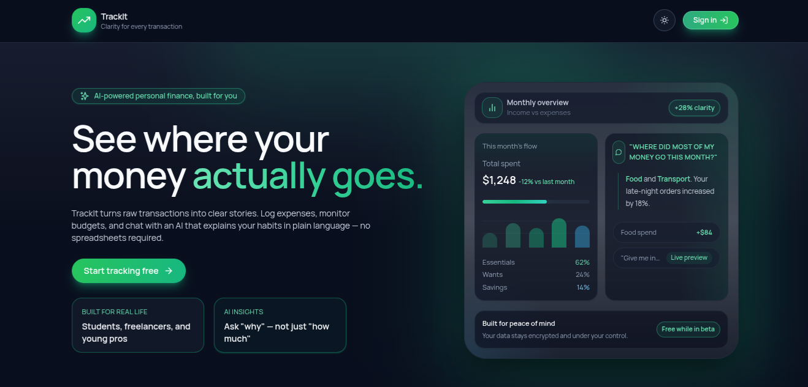

# TrackIt

TrackIt is a modern, intentionally calm personal finance workspace. The client wraps an AI-first dashboard, guided analytics, and secure user/admin flows into a responsive React 19 + Vite + Tailwind UI so you can explore budgets, invoices, and productivity data without drilling through spreadsheets.


_Homepage preview (screenshot stored at `src/assets/image.png`)._

## Why TrackIt?

- **AI-guided clarity.** Ask the assistant what your spending patterns mean, get conversational summaries, and chase clarity instead of numbers.
- **Role-aware experiences.** Authenticated users see overview, transactions, analytics, AI assistant, and security settings, while admins get dedicated dashboards for user oversight and system health.
- **Security-first.** The UI works with the backend’s CSRF-protected cookies and strict password requirements so every request feels deliberate.
- **Mobile-friendly canvas.** Responsive layouts make dashboards, grids, and insights look great on both desktop and mobile without losing detail.

## Core client features

- **Landing experience:** Hero, problem, feature, and how-it-works sections introduce TrackIt’s mission before any login.
- **Onboarding & auth flows:** Sign-up/sign-in, password resets, security questions, and logout hooks talk to `/api/auth`.
- **User workspace:** Dashboard routes wire up overview, transaction histories, analytics, AI assistant chats, and settings inside guarded layouts.
- **Admin surfaces:** Dedicated routes for dashboards, user management, and system health that live under `/admin` and enforce role gates.
- **AI assistant:** Conversations are stored server-side and surfaced inside the assistant page via the assistant service.
- **State & services:** Axios-powered `apiClient` handles CSRF headers automatically and centralizes axios configuration for auth, transactions, analytics, and admin services.

## Tech stack highlights

- **Framework:** Vite 7 + React 19 with Suspense/lazy routes for fast initial load.
- **Styling:** Tailwind CSS 3 with utility-first design tokens (`trackit-*` colors) and motion-friendly components (Framer Motion).
- **State & data:** Redux Toolkit, Recharts, and Axios services keep client-server communication structured.
- **Security/UX:** RoleGate/SecurityGate guards, cookie-aware API client, and service-layer helpers mirror the Node/Express security posture.

## Relevant files & folders

- `src/App.jsx` – Client-side routing, layout guards, and suspense fallbacks for every route.
- `src/pages` – Lazy-loaded page components for public, user, and admin flows.
- `src/components` – Shared UI blocks (layout, auth, home) that shape the homepage and dashboard pieces.
- `src/services` – API calls grouped by domain (`authService`, `transactionService`, etc.) with CSRF handling baked in `apiClient`.
- `src/store` – Redux slices and store setup for global client state.

## Getting started

1. **Install dependencies.**
   ```bash
   cd client
   npm install
   ```
2. **Set up the backend.** TrackIt uses the `/server` Node/Express app (MongoDB + JWT auth); make sure it is running locally or provide its URL via `VITE_API_URL`.
3. **Start the dev server.**
   ```bash
   npm run dev
   ```
   The app will auto-reload on file change and proxy calls through `apiClient`.

## Environment variables

- `VITE_API_URL` – (optional) Override the default `http://localhost:4000` API base URL.

## Available scripts

- `npm run dev` – Runs the Vite dev server with HMR.
- `npm run build` – Produces an optimized production bundle under `dist/`.
- `npm run preview` – Serves the production bundle locally.
- `npm run lint` – Runs ESLint across the project.

## Next steps

If you are developing features, keep the backend contracts in sync (especially new endpoints under `/api/`). For testing, run the lint script and add unit/feature coverage as needed.

## Live demo

- Frontend: https://track-it-neon-two.vercel.app/
